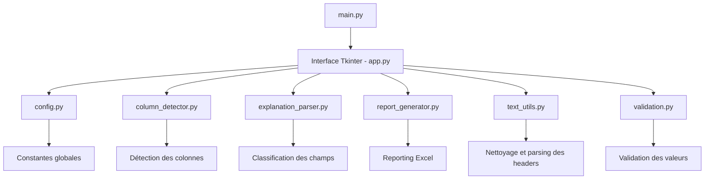
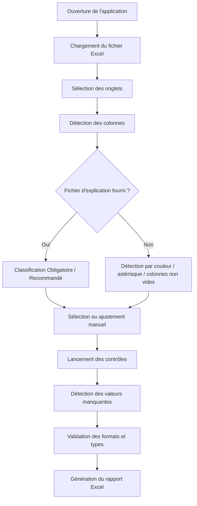
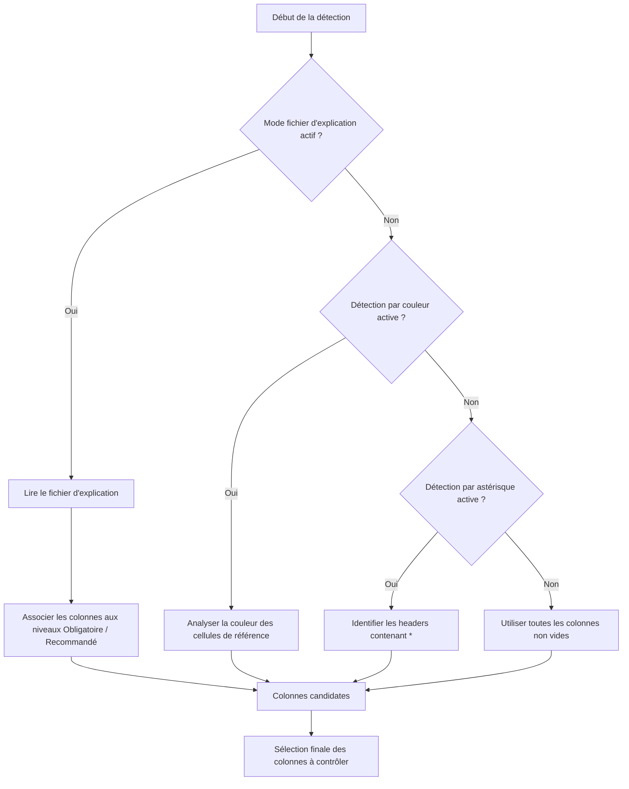
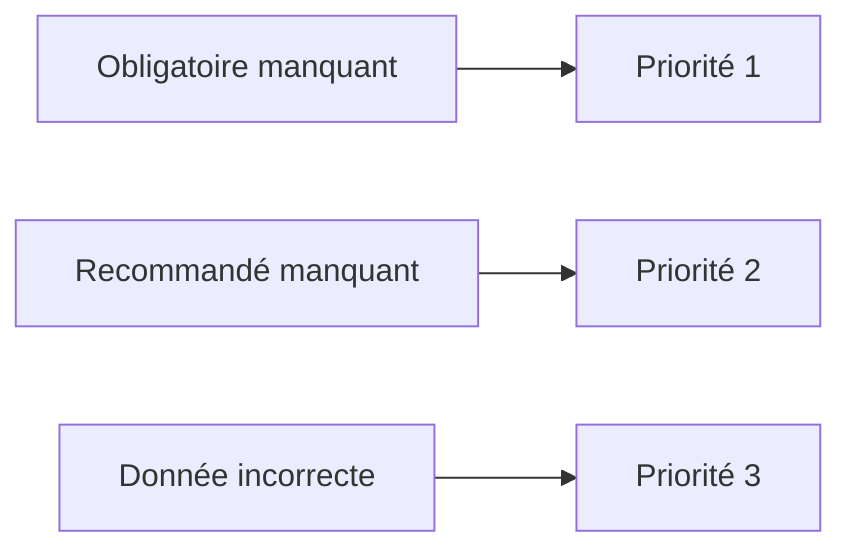
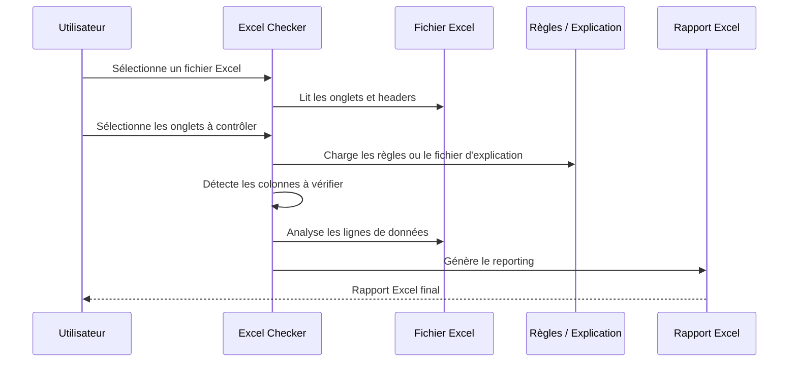

# Excel Checker Refactor

Application desktop développée en **Python / Tkinter** permettant de contrôler des fichiers Excel de migration ou de qualité de données.

L'application détecte les colonnes à vérifier, contrôle les valeurs attendues, identifie les données manquantes ou incorrectes, puis génère un **rapport Excel structuré, trié et coloré**.

Elle a été pensée pour être utilisée sur des fichiers de migration ou des modèles de chargement liés à des contextes ERP comme **SAP**, **Microsoft Dynamics 365**, **Cegid**, ou tout autre système nécessitant des contrôles de données avant import.

---

## Sommaire

- [Objectif](#objectif)
- [Fonctionnalités](#fonctionnalités)
- [Structure du projet](#structure-du-projet)
- [Architecture](#architecture)
- [Workflow global](#workflow-global)
- [Logique de détection des colonnes](#logique-de-détection-des-colonnes)
- [Reporting](#reporting)
- [Installation](#installation)
- [Lancement](#lancement)
- [Génération d'un exécutable](#génération-dun-exécutable)
- [Cas d'usage](#cas-dusage)
- [Évolutions possibles](#évolutions-possibles)

---

## Objectif

L'objectif de l'application est de simplifier les contrôles Excel avant intégration ou migration de données.

Elle permet notamment de :

- détecter automatiquement les colonnes importantes ;
- distinguer les champs obligatoires et recommandés ;
- vérifier les cellules vides ;
- contrôler certains formats de données ;
- générer un rapport lisible pour les utilisateurs métier ou les consultants ;
- limiter les contrôles manuels longs et répétitifs.

---

## Fonctionnalités

### Détection des colonnes

L'application peut identifier les colonnes à contrôler selon plusieurs méthodes :

- détection par **couleur** ;
- détection par présence d'un **astérisque `*`** dans l'en-tête ;
- détection via un **fichier d'explication** ;
- sélection manuelle des colonnes ;
- fallback automatique sur les colonnes non vides.

### Classification des champs

Lorsqu'un fichier d'explication est fourni, les colonnes peuvent être classées en :

- **Obligatoire** ;
- **Recommandé** ;
- autre statut selon les règles définies dans le fichier source.

Cette classification permet ensuite d'adapter le niveau de criticité dans le reporting.

### Sélection des onglets et colonnes

L'utilisateur peut :

- choisir les onglets Excel à analyser ;
- sélectionner les colonnes à contrôler pour chaque onglet ;
- combiner une détection automatique avec un ajustement manuel.

### Validations disponibles

L'application peut contrôler :

- les champs obligatoires manquants ;
- les champs recommandés manquants ;
- les formats email ;
- les types de données ;
- les longueurs attendues ;
- les formats détectés dans les en-têtes.

### Types de données supportés

Les types suivants peuvent être détectés ou validés selon les métadonnées présentes dans les en-têtes :

- `Texte` / `Text`
- `Email`
- `Numérique` / `Numeric` / `Number`
- `Entier` / `Integer`
- `Décimal` / `Decimal`
- `Date`
- `Booléen` / `Boolean`
- `Téléphone` / `Phone`
- `Alphanumérique` / `Alphanumeric`

### Interface utilisateur

L'interface est développée avec **Tkinter**.

Elle inclut :

- une fenêtre principale redimensionnable ;
- une taille minimale définie ;
- des sections de configuration ;
- une gestion de contenu scrollable ;
- une interface pensée pour rester utilisable sur des résolutions plus petites.

---
## Structure du projet

```text
excel_checker_refactor/
│
├── main.py
│
├── excel_checker/
│   ├── config.py
│   ├── models.py
│   │
│   ├── ui/
│   │   └── app.py
│   │
│   ├── services/
│   │   ├── column_detector.py
│   │   ├── explanation_parser.py
│   │   ├── phone_number_service.py
│   │   ├── postal_code_service.py
│   │   └── report_generator.py
│   │
│   └── utils/
│       ├── text_utils.py
│       └── validation.py
│
├── rule_set.json
├── app2.ico
└── README.md
```

### Description des principaux fichiers

| Fichier | Rôle |
|---|---|
| `main.py` | Point d'entrée de l'application |
| `excel_checker/config.py` | Constantes globales |
| `excel_checker/ui/app.py` | Interface graphique Tkinter |
| `excel_checker/services/column_detector.py` | Détection des colonnes à contrôler |
| `excel_checker/services/explanation_parser.py` | Lecture et parsing du fichier d'explication |
| `excel_checker/services/report_generator.py` | Génération du rapport Excel |
| `excel_checker/utils/text_utils.py` | Nettoyage et analyse des textes / headers |
| `excel_checker/utils/validation.py` | Fonctions de validation des formats et types |

## Architecture



## Workflow global



## Logique de détection des colonnes



## Reporting

Le rapport généré est un fichier Excel contenant une vision globale et un détail par feuille analysée.

### Contenu du reporting

Le reporting peut contenir :

- un onglet de synthèse globale ;
- un détail par onglet analysé ;
- le nom de l'onglet impacté ;
- le numéro de ligne ;
- la colonne concernée ;
- la valeur détectée ;
- la raison de l'erreur ;
- le niveau de criticité ;
- une mise en couleur pour faciliter la lecture.

### Priorisation des erreurs



### Code couleur

| Couleur | Signification |
|---|---|
| 🔴 Rouge | Champ obligatoire manquant |
| 🟡 Jaune | Champ recommandé manquant |
| 🔵 Bleu | Donnée incorrecte ou format invalide |

### Tri des erreurs

Les anomalies sont triées selon l'ordre suivant :

1. champs obligatoires manquants ;
2. champs recommandés manquants ;
3. données incorrectes ou invalides.

## Installation

### Prérequis

- Python 3.x
- `openpyxl`
- `tkinter`

### Installation des dépendances

```bash
pip install openpyxl
```

Selon l'environnement Python utilisé, `tkinter` peut déjà être inclus.

## Lancement

Depuis la racine du projet :

```bash
python main.py
```

## Génération d'un exécutable

Le projet peut être packagé avec **PyInstaller** afin de produire un exécutable Windows.

Exemple de commande :

```bash
pyinstaller -F -w --icon=app2.ico --clean --noconsole --name "Excel Checker" --add-data "rule_set.json;." --add-data "app2.ico;." main.py
```

### Notes

- `-F` génère un exécutable unique.
- `-w` / `--noconsole` masque la console.
- `--icon` définit l'icône de l'application.
- `--add-data` permet d'inclure les fichiers nécessaires au runtime.
- `--clean` force PyInstaller à nettoyer le cache de build.

En cas de problème de build, il peut être utile de supprimer les dossiers suivants avant de relancer la commande :

```text
build/
dist/
```

## Cas d'usage

L'application peut être utilisée pour :

- contrôler des fichiers de migration de données ;
- vérifier des templates de chargement ERP ;
- préparer des imports SAP ou Dynamics 365 ;
- vérifier la qualité des données avant intégration ;
- automatiser des contrôles métier récurrents ;
- produire un rapport de validation lisible et partageable.

## Exemple de logique métier



## Configuration

Les paramètres globaux sont centralisés dans :

```python
excel_checker/config.py
```

On y retrouve notamment :

- la ligne d'en-tête utilisée par défaut ;
- la taille minimale de la fenêtre ;
- la regex email par défaut ;
- les constantes utilisées par la logique applicative.


## Résumé

**Excel Checker Refactor** est une application modulaire de contrôle Excel qui permet de :

- charger un fichier Excel ;
- sélectionner les onglets à analyser ;
- détecter automatiquement les colonnes importantes ;
- classifier les champs obligatoires et recommandés ;
- valider les valeurs attendues ;
- détecter les anomalies ;
- générer un rapport Excel clair, priorisé et coloré.

L'application vise à réduire les contrôles manuels, fiabiliser les fichiers avant import et améliorer la qualité des données dans des contextes de migration ou de transformation digitale.
